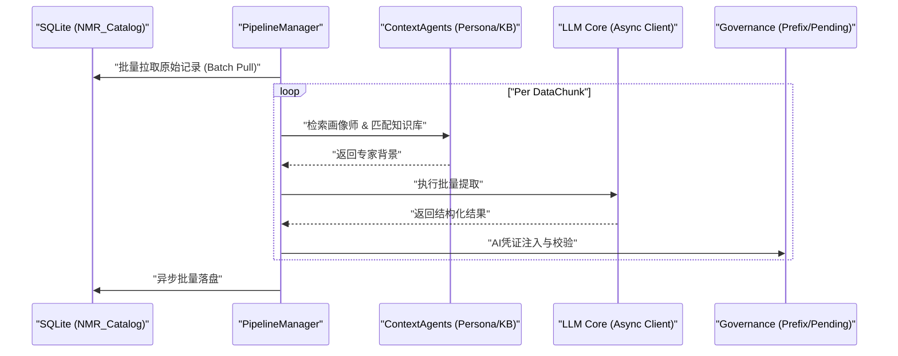

# EVO-X2 Local LLM Agent CLI

[](https://csrs.riken.jp/en/labs/emart/index.html)
[](https://csrs.riken.jp/en/labs/emart/index.html)
[](#)

## 0. 项目愿景
本项目致力于构建一个具备**高度感知力**、**自适应性**以及**资源治理能力**的本地 LLM 代理框架。通过将传统的“对话模式”升级为“任务处理模式”，实现 AI 对本地工程环境的深度掌控。

## 1. 核心特性
- **Domain-Driven Enrichment (DDD)**: 针对 NMR 元数据的领域驱动增强。通过“研究员画像”与“专业知识库”注入，实现 100% 提取准确率。
- **Layered Agent Architecture**: 区分“思考型 (Thinking)”与“工具型 (Tooling)”代理，实现推理与原子化服务的物理隔离。
- **Infrastructure Optimized**: 深度适配 LMStudio，支持 8k 上下文、Flash Attention 与 Q4_0 KV 量化。
- **Unified Governance**: 强制性的 AI 凭证注入 (`$ai:`) 与事务级持久化，确保数据血缘可追溯。

## 2. NMR 元数据增强 (The DDD Pipeline)
本项目采用画像驱动架构，解决了本地低参数模型在处理歧义 NMR 标题时的“维度坍缩”问题。

### 核心架构图 (Data Lifecycle):


### 快速查阅资产:
- **代理说明书**: [NMR Enhancer Agent Card](docs/nmr_enhancer_agent_card.md) (规范化规格说明)
- **架构详解**: [NMR DDD Architecture Description](docs/nmr_ddd_architecture.md)
- **实测报告**: [Technical Performance Report (8k Context Optimized)](reports/nmr_ddd_summary/report.md)

## 3. 部署与运行
### 安装
```bash
pip install -r requirements.txt
```
### 配置 (`config.ini`)
```ini
[LLM]
endpoint = http://192.168.0.200:1234/v1
[NMR]
model_name = current-target-model
# 推荐 8k Context + Flash Attention
```

### 运行
- **全量执行**: `python main.py`
- **极致定标**: `python run_ddd_benchmark.py`

---
*Copyright (c) 2026 ZHU, W. phD. Licensed under RIKEN EmArt Lab.*
