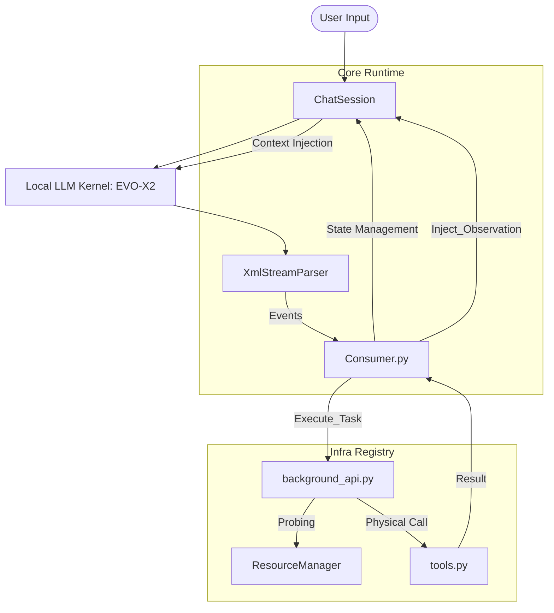

# 链路架构描述 (Chain Architecture Description)

## 1. 宏观交互层级
本项目采用**“推理-解析-执行-反馈”**的解耦式链式架构，确保了系统的响应性与可扩展性。

## 2. 核心模块职责
### 2.1 Core 层 (大脑与决策)
- **ChatSession**: 唯一的事实来源。管理对话历史、持久化元数据以及 Token 统计。
- **XmlStreamParser**: 贪心状态机。负责流式截获 LLM 输出中的 XML 标签，并将其转化为结构化的 `Event` 对象。
- **Consumer**: 任务分发中心。处理 `Event` 路由，并决定是否将反馈注入后续对话。

### 2.2 Infra 层 (肢体与执行)
- **Background API**: 通用任务总线。将抽象的 `Request` 映射到具体的 Python 函数。
- **Unified Resource Manager (URM)**: 资源治理核心。通过 RID (Resource ID) 隔离物理路径，支持自动挂载与自适应读取。
- **Tools**: 内核工具箱。实现了文件系统的安全 IO、系统信息获取以及目录探测。

## 3. 关键机制
### 3.1 极简 metadata 循环
1. **注入**: Session 将当前元数据快照随 System Prompt 注入 LLM。
2. **感知**: LLM 基于元数据做出决策（如调用 `read_resource`）。
3. **更新**: 执行结果或 URM 挂载动作会即时更新内存/磁盘的元数据，形成反馈闭环。

### 3.2 URM 自适应读取
- **路径寻址**: 支持直接填入物理路径。
- **自动挂载**: 探测到路径后，系统自动完成 `probe` -> `register` -> `metadata sync`。
- **安全可见**: 通过 `end="-1"` 实现 100 行预览保护，确保 IO 安全。

---
*Last Updated: 2026-02-10*
