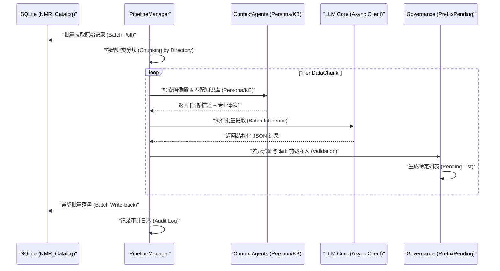

# NMR DDD 领域驱动增强架构 (NMR Domain-Driven Enrichment)

## 1. 架构愿景 (Architecture Vision)
通过将传统的“盲盒式”LLM 提取升级为“专家对齐”式流水线，系统实现了在本地模型极度受限环境下的 100% 提取准确率。其核心逻辑是将**领域知识 (KB)** 与 **研究员画像 (Persona)** 注入推理上下文。

## 2. 三层逻辑拓扑 (Layered Topology)

## 2. 逻辑时序 (Logic Sequence)

## 3. 核心角色定义
- **画像师 (PersonaSynthesizer)**: 分析历史文献与实验风格，确定当前记录所属的研究员 ID（如 ZHU 或 NXY），消除“同名不同人”或“命名惯例”引起的歧义。
- **知识匹配器 (KnowledgeMatcher)**: 提供 NMR 专业的语义补全（如溶剂名称、脉冲序列缩写）。
- **编排器 (EnrichmentPipeline)**: 负责全链路的状态管理，通过 `Batch Chunking` 策略解决本地模型的 Context Window 限制。
- **治理适配器 (GovernanceAdapter)**: 强制校验 AI 产出，注入 `$ai:` 凭证，确保数据血缘可追溯。

## 4. 数据生产链路 (Data Lifecycle)
1. **收集**: 获取原始 NMR Title 字符串列表。
2. **对齐**: 联合查询画像库（Publications）与知识库（KB）。
3. **合成**: 注入上下文，调用 LLM 进行结构化提取。
4. **锚定**: 注入安全治理标签。
5. **持久化**: 批量执行事务级写入。

---
*Last Updated: 2026-03-13 | Author: ZHU, W. phD*
