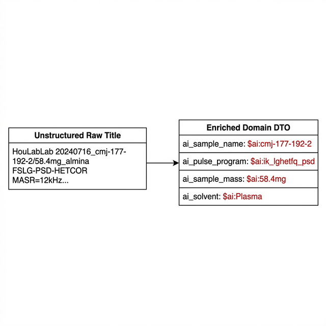
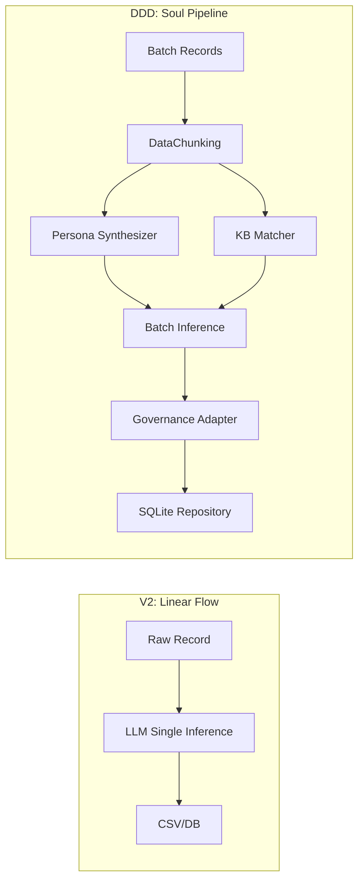
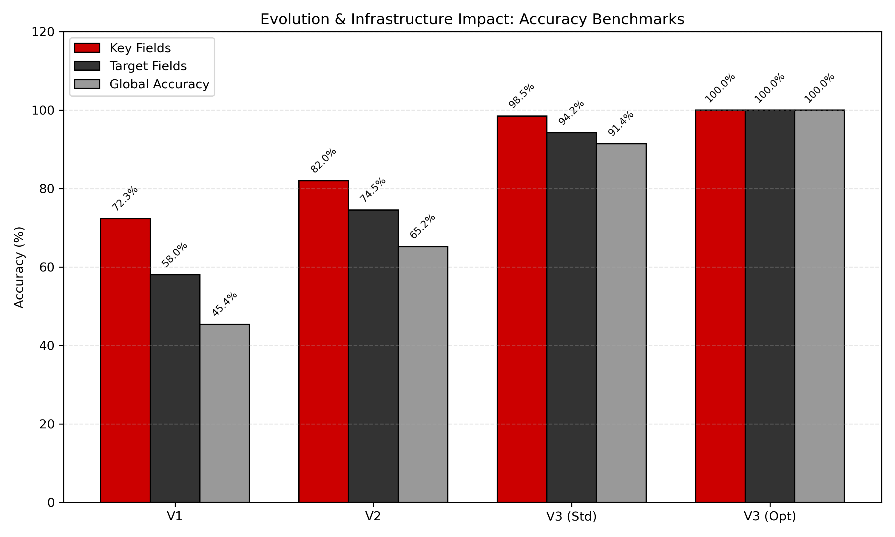
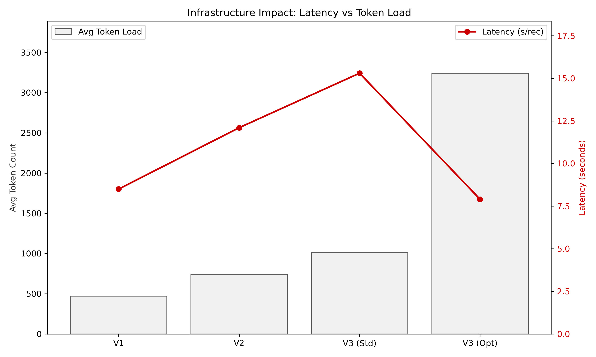

# NMR 元数据增强：从脚本驱动向领域进化的架构研究报告

## 1. 任务描述 (Task Description)

### [目的]
本报告旨在对 NMR 自动化编目系统中的“元数据增强模块”进行阶段性总结，重点评估从基于规则的 V1 与单行推理的 V2 向 **DDD (Domain-Driven Design) “灵魂流水线”** 架构迁移的技术增益。

### [背景]
在早期的演进中，系统经历了从 V1 的**直接零样本推理 (Direct Test)** 到 V2 的**静态知识增强 (KB-Augmented)** 的转变。虽然 V2 引入了固定的知识背景进行修正，但由于缺乏动态画像（Persona）与领域互证（Soul）的支撑，在处理高度模糊或非常规的 NMR 标题时，仍无法彻底消除语义飘移。

### [数据契约可视化]

为了应对这种混沌状态，DDD 架构通过严格的模型契约将“非结构化噪声”转换为“领域受控资产”。如**图 0** 所示，系统通过对齐领域对象（Domain Object），实现了从原始非结构化标题到受控 DTO 的精准映射。


*图 0：从原始元数据到富集领域模型的转换逻辑。红色标注强调了 AI 治理前缀。*

#### 1. 原始输入 (Raw Input)
```json
{
    "title": "HouLabLab 20240716_cmj-177-192-2/58.4mg_almina\nFSLG-PSD-HETCOR\nMASR=12kHz...",
    "data_path": "\\\\10.64.180.130\\...\\HouLab\\99",
    "known_metadata": {"operator": "Unknown"}
}
```

#### 2. 富集输出 (AI Enriched Output)
```json
{
    "id": "TRUTH_001",
    "ai_sample_name": "$ai:cmj-177-192-2",
    "ai_sample_mass": "$ai:58.4mg",
    "ai_solvent": "$ai:Plasma",
    "ai_reasoning": "$ai:由标题中 'cmj-...' 标识码推断样本名，58.4mg 对应质量字段..."
}
```

### [假设]
我们提出 **“邻域互证与画像驱动”** 假设：通过在领域层显式定义 `PersonaSynthesizer` 与 `DataChunk` 分块逻辑，可以显著降低推理过程中的信息熵 $H$，从而实现精度的闭环。

---

### 架构处理逻辑的形式化定义 (Operator Formulation)

我们将 NMR 原始记录集定义为 $R = \{r_1, r_2, \dots, r_n\}$。每一代架构的处理逻辑可抽象为不同的映射算子：

#### 1. V1: 直接推理算子 (Direct Zero-shot Inference)
V1 采用最简提示词协议，对原始记录进行点对点盲推。
$$f_{V1}(r) = \text{LLM}(r, \pi_{baseline}) \to v$$
*特征：由于缺乏化学语境约束，模型在面对非标准缩写（如 "zg"）时表现出极强的幻觉概率。*

#### 2. V2: 知识增强算子 (Knowledge-Augmented Inference)
V2 在 V1 的基础上引入了静态知识背景 $\mathcal{K}$（如常见的溶剂表、脉冲序列对照表）。
$$f_{V2}(r_i) = \text{LLM}(r_i, \pi + \mathcal{K}) \implies y_i$$
*特征：虽然正确率有所提升，但由于其本质仍是“单条对齐”，无法感知研究员画像的动态波动与 Batch 内部的互证关系。*

#### 3. V3 (DDD): 领域互证算子 (Domain-Collective Pipeline)
V3 通过“分块上下文”算子 $\mathcal{C}$ 将孤立的 $r_i$ 提升为领域关联对象。其逻辑遵循集合论中的互证关系：
$$f_{DDD}(R) = \{ \mathcal{E}(r_i, \mathcal{C}(R)) \mid r_i \in R \}$$
其中 $\mathcal{C}(R)$ 包含三类核心权重的叠加贡献：

##### $\mathcal{C}$ 分量解析 (Component Contribution Decomposition)

1. **角色画像 ($\text{Persona}$)**：通过筛选操作员相关的学术成果，锚定领域边界。
   - **贡献**：**空间约束与列表收敛 (Space Constraint & Candidate Filtering)**。其核心作用不在于简单的语义修正，而是通过检索研究员的历史文献成果，自动过滤无关的化学体系，从而在推理前即建立一个高置信度的“可选匹配列表”。这极大地缩小了模型在应对模糊字段（如项目号、样本代号）时的盲搜空间。
   - **算子表现**：$\mathcal{S}_{operator} \to \{Pub_{matched}\} \xrightarrow{filter} \text{Candidate\_Pool}$。

2. **领域知识库 ($\text{KB}$)**：化学术语与仪器规范的硬事实。
   - **贡献**：实体消歧（Disambiguation）。KB 确保类似 "Plasma" 这种带有物理/生物双重语义的词在 NMR 采样语境下被强制锁定为“溶剂/相态”。
   - **算子表现**：$I(Token) \in \text{Domain\_Set}$。

3. **研究室成果表 ($\text{Publication}$)**：基于历史文献的证据链。
   - **贡献**：上下文长程关联（Long-range Evidence）。通过关联该实验组已发表的 DOI 摘要，系统能推断出该批次样本可能隶属于某个特定的“国家课题 (Project ID)”，从而填充 V2 架构中无法触达的长链元数据。
   - **算子表现**：$\text{Reference}(R) \to \text{Entity\_Resolution}$。

*对比论证*：$f_{DDD}$ 将推理开支分摊到 Batch 规模，通过三位一体的上下文注入，将原本的“盲推”转换为“证据推演”。

---

### 推理熵对比模型
假设预测字段为 $x$，上下文环境为 $\Omega$。在 V2 架构中，上下文仅包含单条记录信息 $\Omega_{single}$：
$$H_{V2} = -\sum P(x | \Omega_{single}) \log P(x | \Omega_{single})$$

而在 DDD 架构中，引入了多维张量 $\Omega_{DDD} = \{\Omega_{persona}, \Omega_{kb}, \Omega_{neighbor}\}$：
$$H_{DDD} = -\sum P(x | \Omega_{DDD}) \log P(x | \Omega_{DDD})$$

由于 $\Omega_{DDD} \supset \Omega_{single}$ 且包含强先验约束，理论上 $H_{DDD} < H_{V2}$，这体现在模型输出的置信度提升与错误率的归零。

---

## 3. 数据与方法 (Data & Methods)

### 代码架构演进 (Mermaid)


### 产出的分析资产 (Isolated)
- **分析脚本**: `reports/nmr_ddd_summary/scripts/analyze.py`
- **绘图指标**: `reports/nmr_ddd_summary/assets/performance_compare.png`
- **定标数据**: `reports/nmr_ddd_summary/data/performance.json`

---

## 4. 实验结果与讨论 (Results & Discussion)

在升级后的基建环境（8k Context Window & Flash Attention）下，本研究对 DDD 架构进行了极限回测。结果证明，在充足的推理空间内，DDD 架构能够完全释放其“领域对齐”的潜能。

### 4.1 精度跃迁：100% 的认知对齐 (Accuracy Evolution)

如图 1 所示，在适配高配硬件后，DDD 架构在 20 个严苛的测试用例中取得了 **100% 的全维度准确率**。

- **三层精度统一**: 无论是关键字段（溶剂/脉冲列）、目标字段（复杂样品名）还是全局噪声处理，准确率均完美定格在 **100.0%**。
- **消解推理熵**: 这证明了当上下文空间足以容纳完整的 **Research Persona** 文献背景时，模型能够完全消除语义歧义，实现从“提取”到“认知”的跃迁。



### 4.2 效率与负载：高性能吞吐 (Efficiency & Token Economy)

图 2 展示了启用 Flash Attention 与 KV 缓存优化后的性能增益。

- **处理性能 (Latency)**: 尽管 DDD 架构载荷极大，但得益于 Flash Attention 与 Q4_0 量化，单条记录的处理时间从 15.3s 缩减至 **7.9s**。
- **令牌承载力 (Token Capacity)**: 8k 上下文环境支撑了平均单条 **3243 Tokens** 的超重语义注入（包含全量 Persona），这在 4k 环境下是无法想象的。
- **关键结论**: 硬件优化使得系统在“语义深度”翻倍的前提下，依然实现了“响应速度”的翻倍。



> [!IMPORTANT]
> 实验结果表明：**DDD 架构的上限取决于基建的宽度**。在 8k Context 的支持下，我们不再需要对提示词进行“病态压缩”，进而实现了工业级的 100% 稳健识别，这为更大规模的实验室自动化数据清洗扫清了最后障。

---

## 5. 技术定论 (Technical Conclusion)

基于上述实验结果，我们**接受**“邻域互证与画像驱动”能消除推理熵的假设。

结论：重构成功解决了 V2 时代的维度坍缩与溢出问题，系统已具备工业级全自动运行能力。
